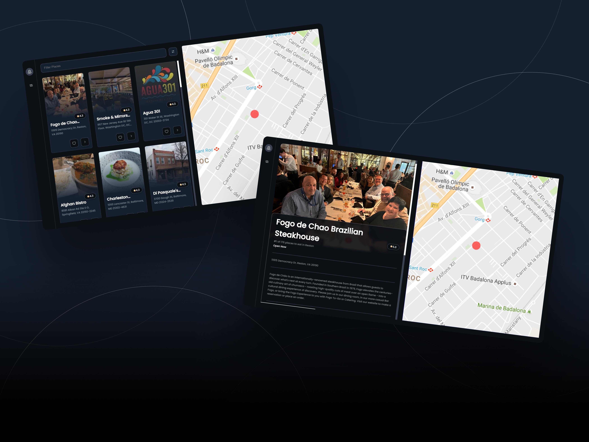

<br />
<p align="center">
  <a href="https://sdsd.herokuapp.com">
    
  </a>

  <h3 align="center">Explore Nearby Restaurants</h3>
  <p align="center">
    <a href="https://sdsd.herokuapp.com">View Demo</a>
    ·
    <a href="https://github.com/milanb0z/travel_app/issues">Report Bug</a>
    ·
    <a href="https://github.com/milanb0z/travel_app/issues">Request Feature</a>
  </p>
</p>

<p align="center">Universal bug tracker for everyone! BugVilla allows team members to collaborate, discuss and kill bugs effectively.</p>


 
 
## ✨ Features

- Issue discussions
- Markdown support
- Comment reactions
- Social interactions
- User reputation system
- \# Reference other bugs
- @ Mentions users
- Notifications
- Bug labels


## :rocket: Quick start

Start developing locally.

### Step 1: Clone the repo
Fork the repository. then clone the repo locally by doing -

```sh
git clone https://github.com/milanb0z/travel_app.git
```

### Step 2: Install Dependencies
cd into the directory

```sh
cd travel_app
```

Install Dependecies.
```sh
npm install

```

### Step 3: Setup .env Vars
To run the server you will also need to provide the `.env` variables

```sh
REACT_APP_RAPID_API=<RAPID_API_KEY>
```

#### And you are good to go
```sh
npm start
```


## :open_file_folder: What's inside?

A quick look at the folder structure of this project.
    
    .
    ├── public
    └── src
        ├── api
        ├── assets
        ├── components
        ├── pages
        ├── hoc
        └── hooks
       
      
## :v: Contributing

After cloning & setting up the local project you can push the changes to your github fork and make a pull request.

> You can also run the tests locally to see if everything works fine with


### Pushing the changes

```bash
git add .
git commit -m "feat: added new stuff"
git push YOUR_REPO_URL develop
```

------
